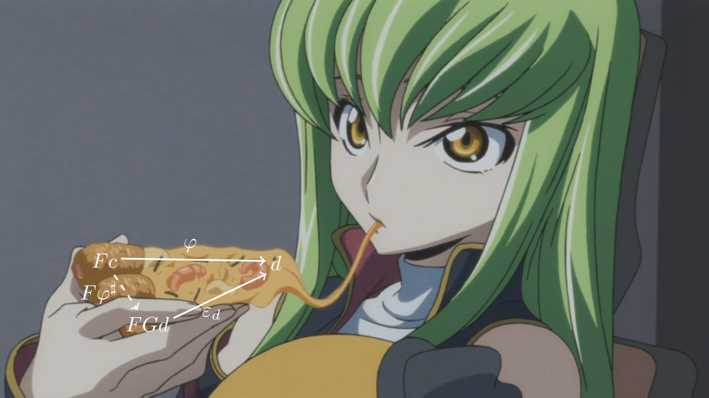

# Category Theory

  

Unpolished notes with my personal pov on category theory — a high-level approach (mostly), lots of diagrams, and polymorphic notation. Mostly focused on the topics I need for my research and the ones I want to have a nice understanding of. I hope to include all standard concepts sooner or later and refactor everything for smoother navigation (though lack of resources will probably interfere)

## 00 Category Theory Basics

1. Categories 
   1. Definitions of a (commutative) diagram and a category
   2. Additional definitions:
      - Mono, epi, iso  
      - Universal objects  
      - Small and locally small categories  
   3. List of examples
2. Functors (definition only)
   - Faithful, full and fully faithful functors
3. Natural transformations (definition only)
   
## 01 Natural Transformations

1. Definition of a natural transformation
2. Vertical and horizontal composition of natural transformations
3. Whiskering
4. Interchange law

## 02 Hom Functor

1. Definition of the set-valued Hom functor (covariant and contravariant)
2. Natural transformations between covariant and contravariant Hom functors

## 03 (Co)Limits

1. Definitions
   - Comma category
   - (Co)Limit
   - (Co)Limit functor
2. Examples
   - Terminal and initial objects
   - (Co)Products
   - (Co)Equalizers
   - (Co)Kernels
   - Pullbacks and pushouts
3. (Co)Continuous functors

## 04 (Co)Monads

### Monads

1. Monoid objects and monads  
2. Kleisli category  
3. Monads and adjunctions *(unfinished)*  
4. Examples  
   1. List monad  
   2. Exception monad  

### Comonads

*Not started*
